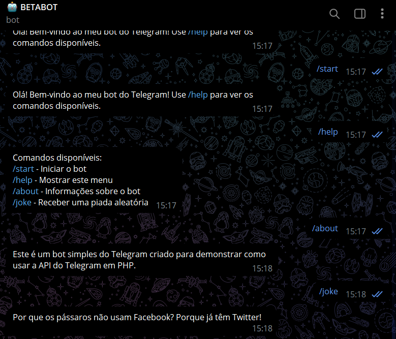

# TELEGRAM BOT COM PHP
🤤ESTE BOT É UMA EXCELENTE MANEIRA DE ENTENDER COMO INTERAGIR COM A API DO TELEGRAM USANDO PHP.

 <br>

## DESCRIÇÃO:
Este bot do Telegram foi projetado para ser uma ferramenta simples e interativa que fornece respostas a comandos e interações básicas. Ele pode dar boas-vindas aos usuários, fornecer uma lista de comandos disponíveis, contar piadas e responder de forma amigável a mensagens que contêm palavras-chave. 

## FUNCIONALIDADES:
1. **Boas-vindas**: 
   - Ao enviar o comando `/start`, o bot cumprimenta o usuário e sugere o uso do comando `/help` para ver os comandos disponíveis.

2. **Comando de Ajuda** (`/help`):
   - Este comando exibe uma lista de todos os comandos disponíveis e suas respectivas funcionalidades:
     - `/start`: Inicia a interação com o bot.
     - `/help`: Mostra os comandos que o bot pode executar.
     - `/about`: Fornece informações sobre o bot e sua finalidade.
     - `/joke`: Retorna uma piada aleatória.

3. **Informações sobre o Bot** (`/about`):
   - O comando `/about` fornece informações gerais sobre o bot, explicando que ele foi criado para demonstrar como usar a API do Telegram em PHP.

4. **Piadas Aleatórias** (`/joke`):
   - Quando o usuário envia o comando `/joke`, o bot responde com uma piada aleatória escolhida a partir de um conjunto predefinido de piadas.

5. **Respostas Personalizadas**:
   - O bot reconhece mensagens que contêm a palavra "oi" e responde com uma saudação amigável, perguntando como pode ajudar.
   - Para qualquer outro texto não reconhecido, o bot informa que não entendeu a mensagem e sugere que o usuário digite `/help` para obter mais informações.

## EXECUTANDO O PROJETO:
1. **Coloque o Token:**
   - Antes de executar, é necessário introduzir o token do seu bot no arquivo `./CODIGO/config.php`, na seção `COLOQUE_SEU_TOKEN_AQUI`, o qual pode ser obtido por meio do [@BotFather](https://t.me/BotFather). 

2. **Inicie o Bot:**
   - Navegue até o diretório `./CODIGO`, e execute o bot do Telegram em PHP iniciando-o com o seguinte comando:
   ```bash
   php index.php
   ```

3. **Interagindo com o Bot:**
   1. **Iniciar o Bot**:
      - Procure pelo seu bot no Telegram.
      - Envie o comando `/start` para iniciar a interação.

   2. **Comandos Disponíveis**:
      - Para ver a lista de comandos disponíveis, digite `/help`.
      - Para saber mais sobre o bot, envie `/about`.
      - Para receber uma piada, basta enviar o comando `/joke`.

   3. **Interações Amigáveis**:
      - Você pode enviar uma mensagem com a palavra "oi" para o bot, e ele responderá de forma amigável, perguntando como pode ajudar.

   4. **Mensagens Não Reconhecidas**:
      - Se você enviar uma mensagem que o bot não entenda, ele informará que não compreendeu e sugerirá que você use o comando `/help`.

## NÃO SABE?
- Entendemos que para manipular arquivos em muitas linguagens e tecnologias relacionadas, é necessário possuir conhecimento nessas áreas. Para auxiliar nesse aprendizado, oferecemos alguns subsidios:
* [VEJA A DOCUMENTAÇÃO](https://core.telegram.org/bots/api)
* [CURSO SUGERIDO](https://github.com/VILHALVA/CURSO-DE-TELEBOT)
* [CURSO DE PHP](https://github.com/VILHALVA/CURSO-DE-PHP)
* [CONFIRA MAIS CURSOS](https://github.com/VILHALVA?tab=repositories&q=+topic:CURSO)

## CREDITOS:
- [PROJETO CRIADO PELO VILHALVA](https://github.com/VILHALVA)
